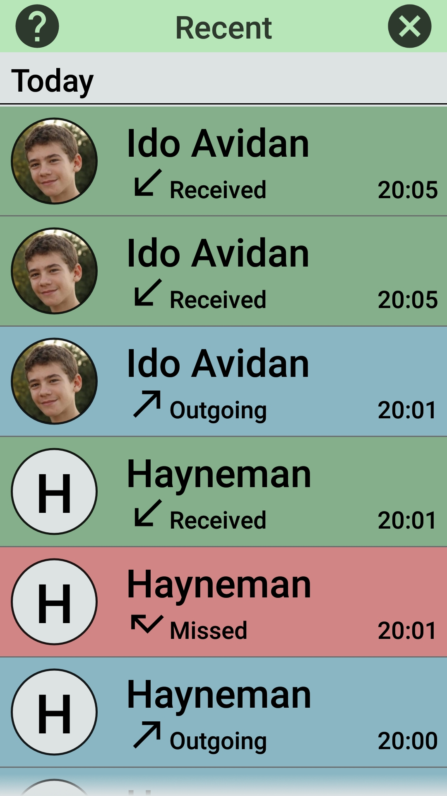
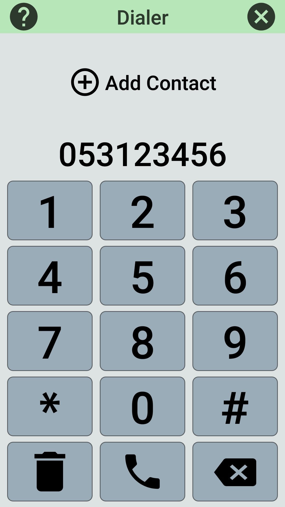
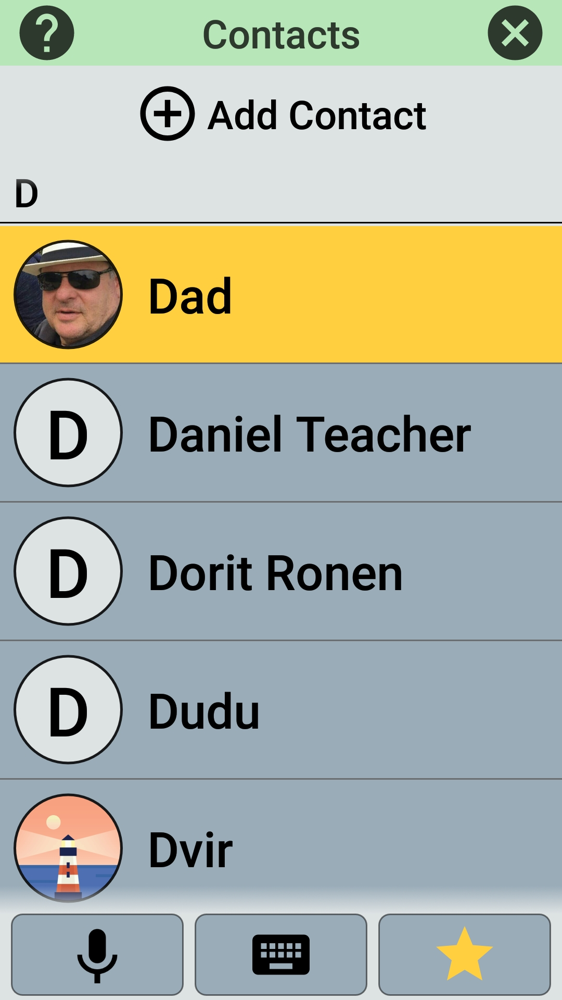
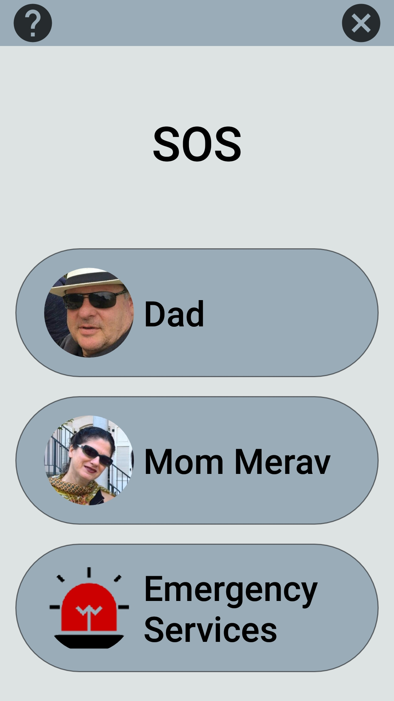
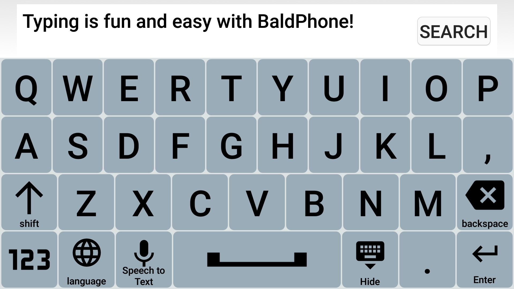
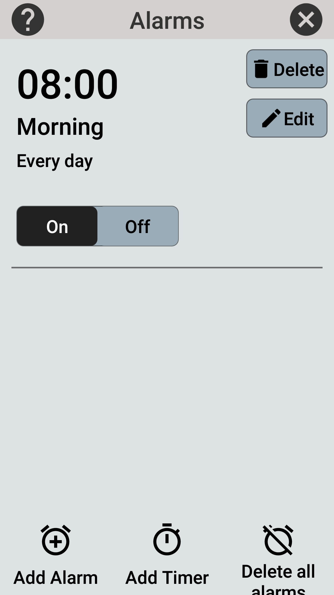
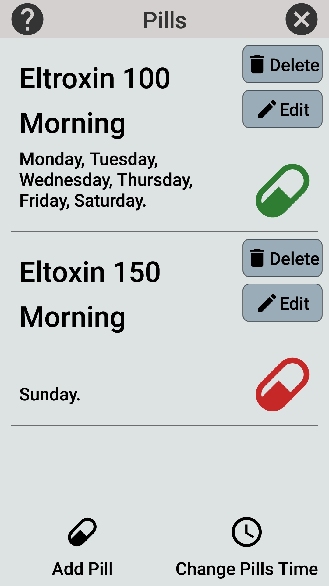
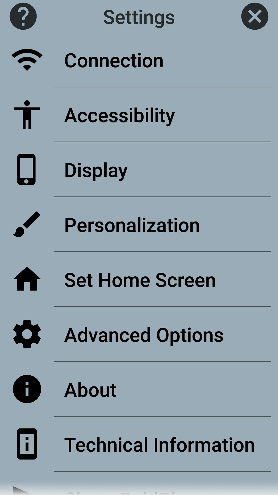

 
A platform which replaces the phone's interface to a bigger, simpler and friendlier one.
 
 - Click the image above to watch the [introductionary video](https://www.youtube.com/watch?v=G33E4XQp_Xw)

# BaldPhone 
 
 
 
 
 
 
 
 
 
 
 

## Documentation
* [Installing Manual pdf](https://github.com/UriahShaulMandel/BaldPhone/raw/master/manual/Manual%20hebrew.pdf) (Hebrew)
* [Contributing](CONTRIBUTING.md)

## Full Version

* [Beta apk](https://github.com/UriahShaulMandel/BaldPhoneCompanion/raw/master/apks/master/tmp_apk.apk) (latest build **for testing purposes**)

## Second Version

* Note: Google Play version does not contain the Recent Calls feature.

## Screenshots

  
More screenshots

 

## Get involved

* [Translating](translating/TRANSLATING.md) BaldPhone to other languages, anyone can do it on [Transifex](https://www.transifex.com/baldphone/baldphone/)
* Adding features and fixing bugs.
* Using BaldPhone and sending feedback
* Share BaldPhone with others
* Star, Watch or Fork this project
* Pull requests are welcome. For major changes, please open an issue first to discuss what you would like to change.
 
 ## Community
* [Subreddit r/BaldPhone](https://www.reddit.com/r/BaldPhone/)
* [Telegram](https://t.me/BaldPhone)

## Shortcuts (for developers)
 - [Home Screen Activity](app/src/main/java/com/bald/uriah/baldphone/activities/HomeScreenActivity.java)
 - [Application Class](app/src/main/java/com/bald/uriah/baldphone/BaldPhone.java)
 - [Main Manifest](app/src/main/AndroidManifest.xml)
 - [build.gradle (app)](app/build.gradle)

## Extras
* [Companion Repository](https://github.com/UriahShaulMandel/BaldPhoneCompanion) - Auto generated screenshots, test apks and db backups
* Feel free to contact me at [baldphone.contact@gmail.com](mailto:baldphone.contact@gmail.com?subject=[GitHub]%20BaldPhone)

## Reviews (your opinion matters)
* [AlternativeTo](https://alternativeto.net/software/baldphone/about/)
* [Slant](https://www.slant.co/options/36464/~baldphone-review)
